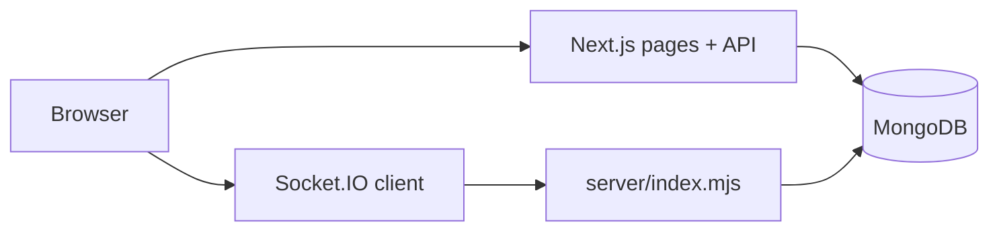

# FC26 Auction

A real-time football player auction web app for custom FC leagues. Managers register, join auction rooms, bid on players within a budget, build lineups, and track tournaments. Admins create rooms, control live auctions, manage rosters, and switch player catalogs.

**Live:** [https://fc26-test-auctions.onrender.com](https://fc26-test-auctions.onrender.com)

---

## How it works

1. **Player data** — JSON files in `public/` are imported into MongoDB. An active **edition** (`fc24`, `fc26`, or `lower-rated`) controls which catalog the app uses.
2. **Auth** — Managers register/login with email and password (NextAuth JWT sessions). Admins have the same login with role `admin`.
3. **Room access** — Admin creates an auction room and grants managers permission to join it.
4. **Live auction** — Admin and managers open `/auction/[roomId]`. The page loads room state over REST, then connects to **Socket.IO** for real-time bids, timer ticks, player changes, and sold events.
5. **Bidding** — Managers place bids; the server validates budget, increment, cooldown, and room access. When the timer ends, the highest bidder wins the player.
6. **Squad & dashboard** — Won players appear in the manager dashboard. Managers assign lineups and view achievements per room.



> **Note:** Live auction requires the custom Node server (`npm run dev` / `npm start`). Serverless hosts (e.g. Vercel-only) run the UI/API but not Socket.IO.

---

## Tech stack

| Area | Stack |
|------|--------|
| Frontend | Next.js 16 (App Router), React 19, TypeScript, Tailwind CSS v4 |
| Backend | Next.js Route Handlers, custom Node server (`server/index.mjs`) |
| Real-time | Socket.IO |
| Auth | NextAuth v5 (credentials provider) |
| Database | MongoDB Atlas |
| Validation | Zod |
| Tests | Vitest |

---

## Features implemented

### Public
- Home page with role-aware CTAs
- Player catalog (search, filters, pagination, edition badge)
- Player profile pages
- Compare up to 4 players (searchable pickers, shareable URL)
- Tournament list and detail (standings, fixtures)

### Manager
- Register / login
- Dashboard (budget, squad, room access, quick actions)
- Join assigned auction rooms
- Live bidding with quick bid buttons
- Lineup builder (drag/drop + mobile tap-to-assign)
- Achievements list
- Squad cards linked to player profiles

### Admin
- Admin panel (users, rooms, roster, tournaments, badges)
- Create/delete auction rooms, end/reset rooms
- Grant/revoke per-room manager access
- Live auction controls (set player, start/pause, sold, skip)
- Searchable player picker (sold players disabled)
- Runtime settings (timer, bid increment, cooldown, active edition)
- Setup guide checklist
- Manager stats and squad overrides

### Live auction engine
- Real-time state sync (bids, timer, current player, sold list)
- Socket auth tied to login session
- Server-side bid validation (budget, increment, cooldown, anti-spoof)
- Manager opt-out with auto-pause
- Sold player tracking in picker and feed
- Connection status badge in auction room

### UX / polish
- Mobile nav, breadcrumbs, skeleton loaders
- Global error and not-found pages
- Page metadata titles
- Navbar live-auction indicator
- Footer with role-aware links

---

## Project structure

```
fc26-test-auctions/
├── public/                      # Player JSON catalogs
├── scripts/                     # Import & edition scripts
├── server/
│   ├── index.mjs                # HTTP server + Socket.IO bootstrap
│   ├── lib/                     # Server MongoDB helpers
│   └── socket/                  # Socket auth, handlers, room runtime
└── src/
    ├── app/
    │   ├── (public)/            # Home, login, register, players, tournaments
    │   ├── (app)/               # Dashboard, admin, auction (protected)
    │   └── api/                 # REST API route handlers
    ├── components/
    │   ├── auction/             # Auction room, bid panel, player picker
    │   ├── dashboard/           # Lineup, achievements
    │   ├── features/admin/      # Admin panel tabs
    │   └── layout/              # Navbar, footer, breadcrumbs
    ├── hooks/                   # useAuctionSocket, useLiveAuctionRoom
    ├── lib/                     # Auth, MongoDB, validations, auction helpers
    ├── services/                # Data access for API routes
    └── types/                   # Shared TypeScript types
```

---

## API routes

### Auth
| Method | Route | Description |
|--------|-------|-------------|
| POST | `/api/auth/register` | Register manager account |
| GET/POST | `/api/auth/[...nextauth]` | Login, session, logout |

### Players
| Method | Route | Description |
|--------|-------|-------------|
| GET | `/api/players` | Paginated player list (active edition) |
| GET | `/api/players/version` | Active edition info |
| POST | `/api/players/version` | Switch edition (admin) |

### Dashboard
| Method | Route | Description |
|--------|-------|-------------|
| GET | `/api/dashboard` | Manager dashboard summary |
| GET | `/api/dashboard/lineup` | Lineup for a room |
| PUT | `/api/dashboard/lineup` | Save lineup |
| GET | `/api/dashboard/achievements` | User achievements |

### Auction
| Method | Route | Description |
|--------|-------|-------------|
| GET | `/api/auction/rooms` | List auction rooms |
| POST | `/api/auction/rooms` | Create room (admin) |
| DELETE | `/api/auction/rooms` | Delete room (admin) |
| GET | `/api/auction/room/[roomId]/state` | Room live state + sold players |
| GET | `/api/auction/room/[roomId]/manager-state` | Manager budget/squad in room |

### Admin
| Method | Route | Description |
|--------|-------|-------------|
| GET | `/api/admin` | Admin panel summary |
| GET/PATCH | `/api/admin/settings` | Auction defaults + edition |
| GET/POST | `/api/admin/room-access` | Room join permissions |
| GET/POST/PATCH | `/api/admin/manager-stats` | Manager squad/budget overrides |
| GET/POST/PATCH/DELETE | `/api/admin/users` | User management |
| GET/POST/DELETE | `/api/admin/achievements` | Badge definitions |
| GET/POST/PATCH/DELETE | `/api/admin/tournaments` | Tournament CRUD |

### Other
| Method | Route | Description |
|--------|-------|-------------|
| GET | `/api/test-db` | MongoDB connectivity check |
| GET | `/health` | App health check |

---

## Socket events

Client connects to the same host as the app. Main events:

| Event | Direction | Purpose |
|-------|-----------|---------|
| `auction:join` | Client → Server | Join room after connect |
| `auction:bid` | Client → Server | Place bid |
| `auction:set-player` | Client → Server | Admin sets current player |
| `auction:start` / `auction:pause` | Client → Server | Admin controls timer |
| `auction:sold-now` / `auction:skip` | Client → Server | Admin end/skip player |
| `auction:opt-out` | Client → Server | Manager opts out of current player |
| `auction:state` | Server → Client | Full room state |
| `auction:bid-updated` | Server → Client | New high bid |
| `auction:timer-tick` | Server → Client | Countdown update |
| `auction:player-set` | Server → Client | New player on block |
| `auction:sold` | Server → Client | Player sold to winner |
| `auction:error` | Server → Client | Validation / access errors |

---

## Database (MongoDB)

Database name: `fc26-auction`

| Collection | Purpose |
|------------|---------|
| `users` | Accounts and roles |
| `players` | Imported player catalogs by edition |
| `settings` | Active edition, auction defaults |
| `auctionRooms` | Room config and status |
| `bids` | Bid history |
| `soldPlayers` | Sold players per room |
| `managerStats` | Budget and squad per manager/room |
| `roomAccess` | Manager join permissions |
| `lineups` | Saved formations |
| `userAchievements` | Earned badges |
| `tournaments` | Tournament data |
| `adminAuditLog` | Admin action log |

---

## Local development

```bash
npm install
cp .env.example .env.local   # set MONGODB_URI, AUTH_SECRET, URLs
npm run import:players -- public/lower-rated-players.json lower-rated
npm run dev                    # http://localhost:3000
```

Promote first admin in MongoDB:

```javascript
db.users.updateOne({ email: "you@example.com" }, { $set: { role: "admin" } });
```
